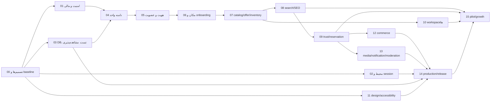

# بستهٔ راهبری و اجرای پروژهٔ «راسته»

این پوشه خروجی ممیزی فنی، محصولی، طراحی و آمادگی انتشار پروژه است. هدف آن فقط «پیشنهاد» نیست؛ هر مرحله به یک برنامهٔ مستقل، قابل‌آزمون و قابل‌تحویل تبدیل شده تا یک عامل هوش مصنوعی بتواند آن را به‌ترتیب اجرا کند، مدرک ارائه دهد و وضعیت را تیک بزند.

## خط مبنا

| مورد | مقدار |
|---|---|
| تاریخ ممیزی | 2026-08-02 |
| مخزن کلاینت | `C:\Users\p.kazemiyeh\StudioProjects\Rasteh_KMP` |
| SHA کلاینت | `2a53bcf` |
| مخزن سرور | `C:\Users\p.kazemiyeh\StudioProjects\Rasteh_Kotlin_Spring_Boot` |
| SHA سرور | `66c83ed` |
| وضعیت اعتبارسنجی کلاینت | `:composeApp:compileKotlinJvm` و `:composeApp:compileKotlinJs` موفق |
| وضعیت اعتبارسنجی سرور | `test` موفق؛ ۴ تست، صفر failure/error/skipped |
| محدودیت مهم | هیچ فایل `RTK.md` یا `AGENTS.md` در دو مخزن پیدا نشد؛ دستور ارجاع‌شدهٔ `@RTK.md` در دسترس نبود |

> هشدار: «قابل‌کامپایل بودن» با «قابل‌انتشار بودن» یکسان نیست. ریسک‌های امنیتی، مالی، داده، عملیات، طراحی و فروشگاه‌های انتشار هنوز وجود دارند.

## نتیجهٔ راهبردی در یک جمله

راسته باید «لایهٔ دیجیتال یک بازار واقعی» باشد: فروشگاه فیزیکی تأییدشده، مکان دقیق، کالای واقعاً قابل‌مشاهده، قیمت/موجودی زمان‌دار، و انتخاب روشن میان `SHOWCASE`، `RESERVABLE` و `BUYABLE`؛ نه نسخهٔ کوچک‌تر دیوار، ترب یا باسلام.

## ترتیب خواندن

1. [گزارش وضعیت فعلی](./CURRENT_STATE_AUDIT.md)
2. [استراتژی محصول و تحلیل رقبا](./PRODUCT_AND_COMPETITIVE_STRATEGY.md)
3. [معماری هدف](./TARGET_SYSTEM_DESIGN.md)
4. [ممیزی طراحی و تجربه کاربری](./DESIGN_AUDIT.md)
5. [آمادگی انتشار](./RELEASE_READINESS.md)
6. [پرامپت مادر اجرا](./MASTER_EXECUTION_PROMPT.md)
7. برنامه‌های مستقل داخل [`tasks/`](./tasks/)

## قرارداد وضعیت

- `[ ] NOT STARTED`: هیچ پیاده‌سازی پذیرفته‌شده‌ای انجام نشده است.
- `[-] IN PROGRESS`: یک عامل در حال اجراست؛ لینک branch/commit و مدرک باید ثبت شود.
- `[?] BLOCKED`: مانع بیرونی یا تصمیم محصولی وجود دارد؛ دلیل و مالک تصمیم باید نوشته شود.
- `[x] DONE`: تمام معیارهای پذیرش، تست‌ها، مهاجرت و مستندات تکمیل شده‌اند.

عامل اجراکننده فقط پس از ثبت شواهد قابل‌بازتولید مجاز است وضعیت را `DONE` کند. «کد نوشته شد»، «بیلد روی دستگاه من پاس شد» یا «به نظر درست است» معیار اتمام نیست.
checkbox این جدول و فیلد `Status` داخل فایل همان task باید در هر تغییر به‌صورت هم‌زمان به‌روزرسانی شوند؛ اختلاف این دو وضعیت، خود یک مانع اجراست.

## نقشهٔ اجرایی

| وضعیت | شناسه | برنامه | وابسته به | خروجی اصلی |
|---|---:|---|---|---|
| [ ] | 00 | [قفل تصمیم‌ها و خط مبنا](./tasks/00_DECISIONS_AND_BASELINE.md) | — | ADR، قرارداد API، دامنهٔ MVP، baseline |
| [ ] | 01 | [رفع فوری نقص‌های امنیتی و مالی](./tasks/01_CRITICAL_SECURITY_AND_FINANCE.md) | 00 | مالکیت سفارش، مبلغ پرداخت، callback، هم‌زمانی |
| [ ] | 02 | [محیط‌ها، secrets، session و logging](./tasks/02_ENVIRONMENTS_SECRETS_AND_SESSIONS.md) | 00 | dev/stage/prod، HTTPS، secure storage، redaction |
| [ ] | 03 | [مهاجرت DB، تست و observability پایه](./tasks/03_DATABASE_TESTS_AND_OBSERVABILITY.md) | 00 | Flyway، Testcontainers، CI gates، tracing/metrics |
| [ ] | 04 | [یکپارچه‌سازی دامنهٔ marketplace](./tasks/04_UNIFY_MARKETPLACE_DOMAIN.md) | 01،03 | حذف دوگانگی محصول/سفارش/نظر/ذخیره |
| [ ] | 05 | [هویت، عضویت فروشگاه و بازاریاب](./tasks/05_IDENTITY_MEMBERSHIP_AND_FIELD_AGENT.md) | 01،04 | نقش‌های پلتفرم و فروشگاه، maker-checker، audit |
| [ ] | 06 | [مکان، فروشگاه، claim و onboarding](./tasks/06_LOCATION_SHOP_AND_ONBOARDING.md) | 05 | گراف بازار/پاساژ/واحد، تأیید و claim |
| [ ] | 07 | [کاتالوگ، Offer، واریانت و موجودی](./tasks/07_CATALOG_OFFERS_AND_INVENTORY.md) | 04،06 | سه mode فروش، freshness SLA، import و media |
| [ ] | 08 | [جستجو، کشف محلی و SEO](./tasks/08_SEARCH_DISCOVERY_AND_SEO.md) | 06،07 | رتبه‌بندی قابل‌توضیح، صفحات indexable، Persian normalization |
| [ ] | 09 | [تجربهٔ مصرف‌کننده و اعتماد](./tasks/09_CONSUMER_TRUST_AND_RESERVATION.md) | 05،07،08 | save/follow، رزرو/quote، review معتبر، report |
| [ ] | 10 | [پنل فروشنده، ادمین و بازاریاب](./tasks/10_VENDOR_ADMIN_AND_AGENT_WORKSPACES.md) | 05،06،07 | workspace نقش‌محور با least privilege |
| [ ] | 11 | [بازطراحی، RTL، responsive و accessibility](./tasks/11_DESIGN_RESPONSIVE_ACCESSIBILITY.md) | 00 | design system منسجم و UX واقعی هر پلتفرم |
| [ ] | 12 | [خرید تک‌فروشگاهی، پرداخت و تسویه](./tasks/12_SINGLE_SHOP_COMMERCE.md) | 01،04،07،09 | order state machine، idempotency، pickup/refund/dispute |
| [ ] | 13 | [رسانه، اعلان، پشتیبانی و moderation](./tasks/13_MEDIA_NOTIFICATIONS_AND_MODERATION.md) | 05،07،09 | storage/CDN، notification، queue پشتیبانی و abuse |
| [ ] | 14 | [زیرساخت تولید، تطبیق و انتشار چهار پلتفرم](./tasks/14_PRODUCTION_AND_PLATFORM_RELEASES.md) | 02،03،11،12،13 | production runbook و انتشار gated |
| [ ] | 15 | [پایلوت، analytics، رشد و درآمد](./tasks/15_PILOT_GROWTH_AND_MONETIZATION.md) | 08،09،10،14 | اجرای یک micro-cluster، WVLO و go/no-go |

## وابستگی کلان

## قواعد تغییر این برنامه

1. هر تصمیمی که قرارداد دامنه، پول، نقش‌ها یا مسئولیت حقوقی پلتفرم را عوض می‌کند باید ADR جدید داشته باشد.
2. هیچ task پایین‌دستی با دورزدن وابستگی‌ها شروع نشود، مگر با waiver مکتوب شامل ریسک و rollback.
3. تغییرات کاربر در worktree متعلق به کاربر است؛ عامل نباید آن‌ها را حذف یا بازنویسی کند.
4. هر migration باید forward-only، قابل rehearsal و دارای برنامهٔ rollback/roll-forward باشد.
5. secrets، credentialهای دمو و دادهٔ شخصی نباید در log، prompt، screenshot یا commit بازتولید شوند.
6. هر فاز با معیار نتیجه بسته می‌شود، نه با تاریخ تقویمی یا تعداد فایل تغییرکرده.
