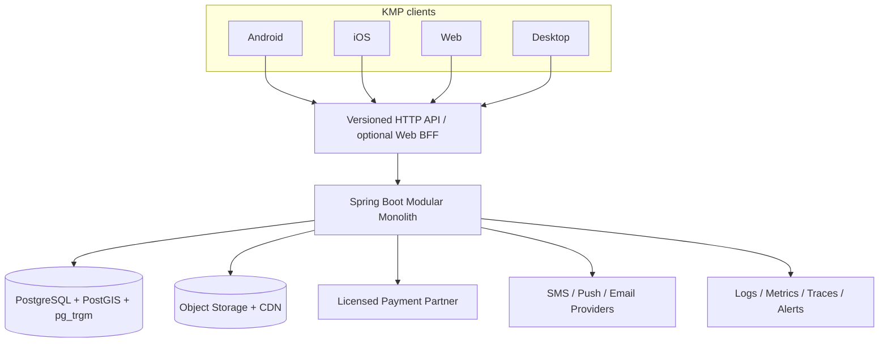

# معماری هدف راسته

## 1. Abstract

معماری هدف یک modular monolith با مرزهای سخت روی PostgreSQL است؛ نه microservice. کلاینت KMP یک app shell سبک دارد و feature entryها را compose می‌کند. هستهٔ دامنه از `MerchantOrganization`, `ShopLocation`, `Listing`, `Product`, `Variant`, `ShopOffer`, `InventoryPosition`, `Reservation`, `Order`, `PaymentAttempt` و `LedgerEntry` ساخته می‌شود.

این طراحی سه حالت عرضه را بدون دو stack مستقل پوشش می‌دهد:

- `SHOWCASE`: صرفاً ویترین و تماس/مسیریابی؛
- `RESERVABLE`: استعلام، quote یا رزرو؛
- `BUYABLE`: قیمت/موجودی دقیق و checkout.

## 2. اهداف و موارد خارج از دامنه

### اهداف

- منبع حقیقت واحد برای فروشگاه، کالا، موجودی و سفارش؛
- پشتیبانی multi-role و چندفروشگاهی؛
- authorization server-side بر اساس platform role + shop membership؛
- موجودی زمان‌دار و قابل‌رزرو؛
- پرداخت idempotent و ledger immutable؛
- جستجوی فارسی و geospatial؛
- API versioned، paginated و قابل‌مهاجرت؛
- privacy، audit و operations قابل اثبات؛
- کلاینت responsive و قابل‌انتشار روی چهار target.

### Non-goals فاز MVP

- microservice split؛
- cart چندفروشندگی؛
- کیف پول/escrow داخلی بدون شریک مجاز؛
- ارسال سراسری یکپارچه؛
- BNPL؛
- recommendation ML پیچیده؛
- live commerce، group buy، loyalty، gift card و عمده‌فروشی.

## 3. معماری زمینه‌ای



Web می‌تواند برای session امن و SEO از BFF/SSR جدا استفاده کند؛ این به معنی microservice دامنه‌ای نیست. session Web ترجیحاً HttpOnly/Secure/SameSite cookie باشد و access token در localStorage ذخیره نشود.

## 4. ماژول‌های سرور

| ماژول | مالکیت داده/رفتار |
|---|---|
| Identity & Access | user، session، platform roles، OTP، account lifecycle |
| Merchant & Membership | merchant organization، shop memberships، KYB/claim |
| Directory & Geo | city، neighborhood، cluster، building/unit، shop location |
| Catalog | product master، variant، taxonomy، attributes |
| Listings & Offers | listing mode، shop offer، price، fulfillment، freshness |
| Inventory | position، snapshot، reservation، adjustment |
| Cart & Pricing | single-shop cart، discount، immutable pricing snapshot |
| Orders & Fulfillment | state machine، pickup/shipping، return/cancel |
| Payments & Ledger | payment attempts، verify، refund، ledger، reconciliation |
| Settlement | payout instruction/status؛ فقط با partner/legal design |
| Trust & Interaction | save/follow، review، quote، report، moderation |
| Content & Media | media metadata، lifecycle، stories/blog محدود |
| Notification | outbox consumer، preference، template، delivery status |
| Admin & Audit | approval queues، immutable audit، impersonation control |

ماژول‌ها در یک process/deployment باقی می‌مانند، اما table ownership و service boundary دارند. هیچ repository نباید مستقیماً از ماژول نامرتبط aggregate را mutate کند؛ cross-module command از application service یا event/outbox عبور می‌کند.

## 5. مدل داده canonical

```text
User
├── PlatformRoleGrant
└── ShopMembership ──> MerchantOrganization ──> ShopLocation

Product ──> Variant
              └── ShopOffer ──> InventoryPosition
                       ├── InventorySnapshot
                       └── FulfillmentOption

Cart ──> PricingSnapshot ──> Order ──> OrderLineSnapshot
                                  ├── InventoryReservation
                                  ├── PaymentAttempt
                                  ├── Refund
                                  └── LedgerEntry
```

### 5.1 مکان و فروشگاه

- `MerchantOrganization`: هویت تجاری؛
- `ShopLocation`: شعبه/واحد فیزیکی با lat/lng و مکان داخل cluster؛
- `Cluster`: راسته، پاساژ یا بازار؛
- `Building`, `Entrance`, `Floor`, `Corridor`, `Unit`: navigation داخلی؛
- temporal occupancy برای تغییر مالک واحد در آینده.

### 5.2 catalog و offer

- `Product`: مشخصات مشترک و غیر‌فروشگاهی؛
- `Variant`: SKU/attribute combination؛
- `ShopOffer`: mode، قیمت، وضعیت و seller-specific content؛
- `InventoryPosition`: مقدار قابل‌فروش/رزرو و version؛
- `InventorySnapshot`: تاریخ و منبع تأیید؛
- `lastConfirmedAt`, `expiresAt` و freshness status.

پول با `Money(minorUnits: Long, currency: CurrencyCode)` یا decimal exact در مرز API تعریف شود؛ `Double` ممنوع.

### 5.3 order و payment

- Order فقط یک shop دارد در MVP؛
- lineها snapshot عنوان، variant، unit price، discount، tax/fee و seller identity در لحظهٔ خرید را نگه می‌دارند؛
- PaymentAttempt کلید idempotency و amount دقیق gateway دارد؛
- ledger append-only است و balance projection محسوب می‌شود؛
- refund/settlement reference یکتا و قابل reconciliation دارند.

## 6. نقش‌ها و authorization

### Platform roles

- `USER`: قابلیت عمومی؛
- `FIELD_AGENT`: ساخت draft و evidence در assignment مشخص؛
- `AGENT_SUPERVISOR`: بررسی کیفیت agent و assignment؛
- `ADMIN`: queueهای عملیاتی تعریف‌شده؛
- `SUPERADMIN`: مدیریت permission/policy با کنترل شدید.

### Shop membership

- `OWNER`, `MANAGER`, `CATALOG_EDITOR`, `ORDER_OPERATOR`, `SUPPORT`.

قواعد:

- هر endpoint یک permission صریح و scope resource دارد؛
- `/api/admin/**` deny-by-default؛
- SUPERADMIN از hierarchy/permission صریح بهره می‌برد، نه string comparison؛
- UI route guard فقط UX است؛ server authority نهایی باقی می‌ماند؛
- تغییر role، ownership، settlement و verification audit immutable دارد؛
- agent نمی‌تواند draft خودش را approve کند.

## 7. lifecycleهای اصلی

### 7.1 onboarding فروشگاه

```text
DRAFT → CONSENTED → SUBMITTED → UNDER_REVIEW
→ APPROVED → CLAIM_PENDING → ACTIVE
                    ↘ REJECTED / NEEDS_CHANGES
ACTIVE → SUSPENDED → REINSTATED | CLOSED
```

guardها شامل identity، physical presence، duplicate resolution، owner claim و category-specific documents است.

### 7.2 offer

```text
DRAFT → ACTIVE_FRESH → ACTIVE_STALE → INQUIRY_ONLY → ARCHIVED
```

mode از lifecycle جداست. `BUYABLE` بدون price، inventory و fulfillment معتبر فعال نمی‌شود.

### 7.3 order

```text
DRAFT → PLACED → PAYMENT_PENDING → PAID → CONFIRMED
→ READY_FOR_PICKUP / SHIPPED → COMPLETED

PAYMENT_PENDING → PAYMENT_FAILED / EXPIRED
PLACED|PAID|CONFIRMED → CANCEL_REQUESTED → CANCELLED → REFUND_PENDING → REFUNDED
```

transition table تنها منبع حقیقت است؛ role، current state و side effect برای هر transition تعریف می‌شوند.

## 8. چرخهٔ درخواست خرید

1. client یک `checkoutAttemptId` تصادفی پایدار برای cart می‌سازد؛
2. server کاربر، shop، lineها، price/freshness و inventory را validate می‌کند؛
3. inventory با lock/version reserve می‌شود؛
4. pricing snapshot و Order اتمیک ایجاد می‌شوند؛
5. PaymentAttempt با `(orderId, attemptId)` unique ساخته می‌شود؛
6. فقط `gatewayPayableAmount` به provider ارسال می‌شود؛
7. callback عمومی اما امضاشده/verify‌شده، attempt را با CAS پردازش می‌کند؛
8. ledger append و order transition در transaction ثبت می‌شوند؛
9. outbox event برای notification/analytics منتشر می‌شود؛
10. client با orderId state را از server می‌خواند؛ deep link به‌تنهایی منبع موفقیت نیست؛
11. cart فقط پس از state `PAID/CONFIRMED` و تطبیق lineها پاک می‌شود.

## 9. consistency و idempotency

| عملیات | کلید/guard | راهکار |
|---|---|---|
| ساخت order | `userId + checkoutAttemptId` | unique constraint و replay همان response |
| payment request | `orderId + attemptId` | unique و state guard |
| callback verify | provider authority | unique + row lock/CAS |
| inventory reserve | variant/offer id + version | pessimistic lock یا optimistic retry |
| refund | order/payment + refund key | append-only ledger و unique business ref |
| notification | outbox event id | inbox dedupe در consumer |
| agent submission | draft revision | optimistic version و audit |

هیچ retry شبکه‌ای نباید عملیات مالی را دوباره ایجاد کند. retry provider فقط برای خطاهای مشخص، با backoff محدود و correlation id است.

## 10. API contracts

### قواعد عمومی

- prefix نسخه مانند `/api/v1`؛
- pagination اجباری با سقف size؛
- error envelope پایدار با `code`, `message`, `correlationId`, `fieldErrors`؛
- ETag/version برای ویرایش concurrent فروشگاه/کاتالوگ؛
- idempotency header برای createهای حساس؛
- ISO-8601 UTC برای timestamp؛
- money به minor units + currency؛
- enum unknown-safe در client؛
- OpenAPI و contract test در CI.

### نمونه Offer

```json
{
  "id": "offer_123",
  "shopId": "shop_42",
  "variantId": "variant_8",
  "mode": "BUYABLE",
  "price": { "minorUnits": 12500000, "currency": "IRR" },
  "availability": "IN_STOCK",
  "availableQuantity": 3,
  "lastConfirmedAt": "2026-08-02T10:30:00Z",
  "expiresAt": "2026-08-03T10:30:00Z",
  "fulfillment": ["PICKUP"]
}
```

## 11. جستجو و رتبه‌بندی

زیرساخت اولیه PostgreSQL + PostGIS + `pg_trgm`/FTS کافی است. موتور خارجی فقط پس از اندازه‌گیری bottleneck اضافه شود.

سیگنال ranking:

- relevance فارسی نرمال‌شده؛
- distance و قابلیت دسترسی؛
- open now؛
- verification؛
- freshness؛
- response rate؛
- cancellation/out-of-stock rate؛
- verified outcome rating؛
- exploration budget برای فروشگاه جدید.

response باید explanation chipهای قابل‌فهم بدهد: «۲۵۰ متر»، «امروز تأیید شده»، «باز است»، «تحویل حضوری امروز».

Web نیازمند URL canonical، SSR/prerender، structured data (`LocalBusiness`, `Product`, `Offer`, `BreadcrumbList`)، noindex روی فیلتر thin و sitemap کنترل‌شده است.

## 12. امنیت و حریم خصوصی

- TLS پیش‌فرض و certificate validation؛
- secret manager/env بدون fallback تولیدی؛
- access token کوتاه‌عمر، refresh rotation و revocation؛
- Keychain/Keystore/credential store؛ Web با cookie امن/BFF؛
- OTP با CSPRNG، hash، attempt/cooldown/rate limit و پاسخ یکنواخت؛
- redacted structured logs؛ body/token/OTP/IBAN ممنوع؛
- encryption at rest برای اسناد هویتی/PII حساس؛
- object storage با random key، magic-byte validation، re-encode/AV scan؛
- consent ledger، data inventory، retention و export/correct/delete؛
- immutable audit برای admin، agent، money و role changes؛
- threat model برای auth، marketplace fraud، upload و payment.

## 13. KMP target architecture

```text
composeApp (app shell, platform bootstrap)
├── core:ui / design-system
├── core:domain-contracts
├── core:network-client
├── core:session
├── core:navigation-contract
└── features
    ├── feature-api (route + public contract)
    └── feature-impl (screen/viewmodel/internal)
```

`core:navigation` نباید implementation همه featureها را import کند. هر feature route registration ارائه می‌کند و app shell capability-aware graph می‌سازد. screenهای بزرگ به state/coordinator/components تقسیم می‌شوند.

platform adapters:

- secure storage؛
- external browser/deep link؛
- media player؛
- share/location/permission؛
- analytics/crash؛
- file picker/camera.

هر adapter support matrix و fallback صریح دارد.

## 14. مهاجرت از وضعیت فعلی

رویکرد expand/contract:

1. baseline DB و Flyway بدون تغییر behavior؛
2. tableهای canonical و invariantها؛
3. backfill product/shop relation و mapping ids؛
4. API v1 canonical و client adapter؛
5. dual-read محدود با telemetry؛
6. انتقال writeها به canonical؛
7. reconciliation report تا اختلاف صفر؛
8. freeze endpointهای legacy؛
9. حذف route/UI stack قدیمی بعد از compatibility window؛
10. contract migration و پاک‌سازی نهایی در release جدا.

هر مرحله backup، dry-run، row counts، checksum و rollback/roll-forward دارد.

## 15. operational readiness

### SLO پیشنهادی pilot

| شاخص | هدف اولیه |
|---|---|
| API availability | 99.5% ماهانه برای pilot |
| search p95 | کمتر از 800ms |
| read API p95 | کمتر از 500ms |
| checkout/order p95 | کمتر از 1500ms بدون زمان provider |
| payment callback processing | 99% زیر 30s |
| notification enqueue | 99% زیر 60s |
| RPO | حداکثر 15 دقیقه |
| RTO | حداکثر 2 ساعت در pilot |

این اهداف پس از load test و ظرفیت واقعی اصلاح شوند.

الزامات:

- health/readiness و dependency checks؛
- metrics برای auth/order/payment/inventory/outbox؛
- trace/correlation id؛
- alert بر callback failure، duplicate، negative invariant، queue lag و error budget؛
- backup اتوماتیک و restore drill؛
- non-root container، pinned base image و SBOM/vulnerability scan؛
- canary/blue-green یا rollback نسخه؛
- runbook incident و reconciliation روزانه.

## 16. گزینه‌های ردشده

| گزینه | دلیل رد فعلی |
|---|---|
| microservices | تیم/ترافیک و مرز دامنه هنوز تثبیت نشده؛ هزینه عملیات بالا |
| ادامه دو stack | تناقض داده و UX و دو برابر شدن bug |
| cart چندفروشندگی در MVP | settlement/refund/fulfillment چندبرابر پیچیده |
| Elasticsearch از روز اول | PostgreSQL برای pilot کافی و ساده‌تر است |
| همه featureها در launch | کاهش عمق هسته و افزایش ریسک اعتماد |
| vendor به‌عنوان global role | چندفروشگاهی و چندنقشی را درست مدل نمی‌کند |

## 17. تصمیم‌های باز

پیش از taskهای وابسته باید تعیین شوند:

1. نقش حقوقی راسته در MVP: معرف، reservation platform یا marketplace transactional؟
2. واحد پول contract: IRR یا تومان نمایشی با ذخیره IRR؟
3. شریک پرداخت/تسویه و امکان split settlement؛
4. خوشه و دستهٔ نخست؛
5. support policy و SLA؛
6. کانال انتشار iOS/Google Play با توجه به eligibility حساب و محدودیت ایران؛
7. provider نقشه، SMS، push و analytics با fallback؛
8. دامنه/نام تجاری نهایی و privacy controller قانونی.

## 18. معیار تصمیم نهایی

معماری زمانی موفق است که یک shop approved بتواند یک offer را از ویترین به رزرو و سپس خرید ارتقا دهد، بدون تغییر entity اصلی، و یک consumer بتواند نتیجه را با مکان، freshness و اعتماد ببیند؛ در عین حال هر order/payment تکرارپذیر، auditپذیر و قابل reconciliation باشد.

